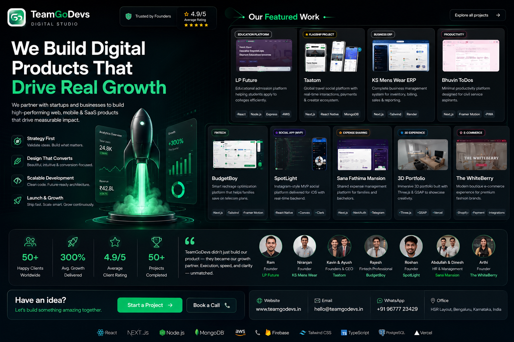

<p align="center">
  
</p>

<h1 align="center">TeamGoDevs</h1>

<p align="center">
  <strong>Web, Mobile &amp; SaaS Product Development Studio</strong>
</p>

<p align="center">
  We design, build, launch, and support digital products for startups and growing businesses —
  from MVPs to production platforms.
</p>

<p align="center">
  <a href="https://www.teamgodevs.in/">Website</a> ·
  <a href="mailto:hello@teamgodevs.in">hello@teamgodevs.in</a> ·
  <a href="https://wa.me/919677723429">+91 96777 23429</a>
</p>

---

## About us

**TeamGoDevs** is a digital product studio based in **HSR Layout, Bengaluru**.

We partner with founders and teams to ship high-performing:

- Web applications (React / Next.js)
- Mobile apps for iOS & Android (React Native)
- SaaS platforms, CRMs, and business software
- Ecommerce experiences
- UI/UX design & brand identity
- SEO, growth, and cloud / DevOps support

Our focus is simple: **build products that ship**, stay maintainable, and support real business outcomes — not just demos.

---

## What this repo is

This repository powers the official TeamGoDevs portfolio site:

**[https://www.teamgodevs.in/](https://www.teamgodevs.in/)**

It showcases our studio, services, process, selected client work, and contact flow.

### Selected work highlights

| Project | Focus |
|--------|--------|
| **Taatom** | Travel social platform (web + mobile) |
| **KS Mens Wear ERP** | Business management / inventory & billing |
| **Lakshya CRM** | Lead & operations CRM |
| **Lakshya** | Finance-focused web platform |
| **Xelarvis** | AI research & consulting web presence |
| **BudgetBoy** | Telecom plan optimization |
| **The WhiteBerry** | Boutique ecommerce |
| **SpotLight** | Social app MVP |
| **LP Future** | Education admissions platform |

Explore the full Work section on the live site.

---

## Tech stack

Built with a modern React stack:

- **Vite** + **React** + **TypeScript**
- **Tailwind CSS** + **shadcn/ui**
- **Framer Motion**
- Deployed on **Vercel**

---

## Local development

```bash
# Install dependencies
npm install

# Start the dev server
npm run dev

# Production build
npm run build

# Preview production build
npm run preview

# SEO readiness checks
npm run seo:audit
```

Create a `.env` from `.env.example` if you need analytics or contact API keys locally.

---

## Contact

| Channel | Details |
|--------|---------|
| Website | [www.teamgodevs.in](https://www.teamgodevs.in/) |
| Email | [hello@teamgodevs.in](mailto:hello@teamgodevs.in) |
| WhatsApp | [+91 96777 23429](https://wa.me/919677723429) |
| Office | HSR Layout, Bengaluru, Karnataka, India |
| Hours | Mon – Fri, 10:00 AM – 7:00 PM IST |

Have an idea? Let’s build something useful together.

---

<p align="center">
  <sub>© TeamGoDevs · Digital product studio since 2019</sub>
</p>
